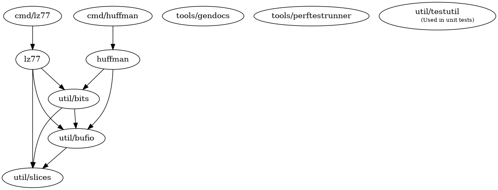

# Implementation document

## Project structure

- `github.com/lassilaiho/compression-algorithms-tiralabra`
  - `cmd`
    - `huffman` - Command line interface for Huffman coding
    - `lz77` - Command line interface for LZ77
  - `huffman` - Huffman coding implementation
  - `lz77` - LZ77 implementation
  - `tools` - Tools for building the project
    - `gendocs` - Generates documentation from templates
    - `perftestrunner` - Test program for generating the performance report
  - `util` - Utility packages used by other packages
    - `bits` - Utilities for reading and writing bit streams
    - `bufio` - Utilities for buffered IO
    - `slices` - Utilities for manipulating slices
    - `testutil` - Utilities for unit testing

### Dependency graph for packages in the project

## Complexity analysis

I achieved the time and space complexities outlined in [the design
document](design-document.md) for both algorithms.

### Huffman coding

Huffman coding consists of two parts: constructing the code table and encoding
the data using the code table.

Code table construction is implemented as specified in the design document and
has a time complexity of O(*n* log *n* + *m*) and space complexity of O(*n*)
where *n* is the number of distinct byte values in the input and *m* is the size
of the input. Because the alphabet size is bounded to 256 (the number of
distinct byte values), *n* is independent of input size.

The actual encoding procedure is simply a matter of mapping input bytes to code
words using the code table. Every input byte is processed once and table lookup
takes a constant time, so the time complexity of encoding is O(*m*). The file is
processed in blocks of constant size, so therefore the space complexity of
encoding is O(1).

Putting these together the time complexity of the entire encoding process
including the code table construction and the byte mapping process is O(*n* log
*n* + *m*) and space complexity is O(*n*). Because *n* is bounded by a constant,
the complexities can be reduced to O(*m*) and O(1) for time and space
complexity, respectively.

Decoding is similar to encoding but in reverse. Encoded files begin with a
description of the Huffman tree used to encode the data followed by the length
of the unencoded data in bytes and finally the encoded data. Reconstructing the
Huffman tree takes O(*n*) time and O(*n*) space. As was previously described,
*n* is bounded by a constant and therefore reconstruction of the tree takes a
bounded amount of time and memory.

The actual decoding process looks up the bytes corresponding to code words. Each
lookup takes O(*n*) time, but since *n* is bounded by a constant the lookup time
is independent of input size and therefore can be considered constant. Each code
word is processed once, so the time complexity of the whole decoding process is
O(*m*). The file is processed in blocks of constant size, so the space
complexity of decoding is O(1).

### LZ77

LZ77 encoding converts the input file into a series of references to previous
occurrences of the data at the current file position. The algorithm remembers a
fixed amount of past data (called "sliding window") against which the current
data is compared to find the longest matching prefix. If no prefix is found the
current byte is emitted. Each input byte is processed once and then added to the
end of the window. The size of the window is constant and therefore independent
of the input size, which means that the maximum number of comparisons performed
for each input byte is bounded by a constant. To speed up comparisons, the
algorithm maintains a dictionary of prefixes, the size of which is also bounded
by a constant. Therefore the time complexity of encoding is O(*m*) and space
complexity is O(*m*) where *m* is the size of the input.

Decoding is very similar to encoding but somewhat simpler. The decoding
algorithm maintains the constant-sized window just like the encoding algorithm.
The window is used to resolve references in the input. No dictionary is required
for decoding. Each reference and literal byte in the input is processed once, so
the time complexity of decoding is O(*m*) and space complexity is O(*m*).

### Algorithm comparison

Huffman coding and LZ77 have the same time and space complexities for both
compression and decompression. However, their encoding speed and memory usage
are drastically different because the constant factor for both time and memory
usage is very high in LZ77 compared to Huffman coding. The reason for this is
that LZ77 has to search for matching prefixes of the current data from the
window and maintaining the dictionary consumes a lot of memory. The dictionary
is not used when decoding and the window takes relatively little space. This is
why the memory usage of LZ77 decoding is about the same as for Huffman encoding
and decoding.

{{ .Gnuplot "execution-times" `
set title "Compression and decompression times"
set xlabel "File size (B)"
set ylabel "Execution time (s)"
set key left top
plot HuffmanComplexity using 6:2 skip 1 smooth unique title "Huffman coding compression", \
  HuffmanComplexity using 6:4 skip 1 smooth unique title "Huffman coding decompression", \
  LZ77Complexity using 6:2 skip 1 smooth unique title "LZ77 compression", \
  LZ77Complexity using 6:4 skip 1 smooth unique title "LZ77 decompression"
` }}

{{ .Gnuplot "memory-usage" `
set title "Compression and decompression peak memory usage"
set xlabel "File size (B)"
set ylabel "Peak memory usage (B)"
set key right center
plot HuffmanComplexity using 6:3 skip 1 smooth unique title "Huffman coding compression", \
  HuffmanComplexity using 6:5 skip 1 smooth unique title "Huffman coding decompression", \
  LZ77Complexity using 6:3 skip 1 smooth unique title "LZ77 compression", \
  LZ77Complexity using 6:5 skip 1 smooth unique title "LZ77 decompression"
` }}

## Possible improvements

I didn't notice any bugs in either algorithm, but both can most likely be
greatly optimized from their current state.

## Sources

- https://en.wikipedia.org/wiki/Huffman_coding
- https://en.wikipedia.org/wiki/LZ77_and_LZ78
- https://www.cs.helsinki.fi/u/tpkarkka/opetus/12k/dct/lecture07.pdf
- Sadakane, Kunihiko & Imai, Hiroshi. (2000). Improving the Speed of LZ77
  Compression by Hashing and Suffix Sorting. IEICE Transactions on Fundamentals
  of Electronics Communications and Computer Sciences. E83A. 
